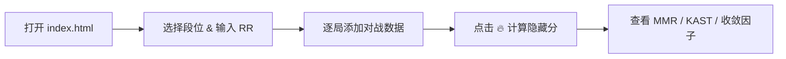
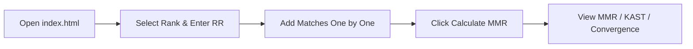

<p align="center">
  
  
  
</p>

<h1 align="center">🎯 VALORANT MMR Calculator / 无畏契约隐藏分计算器</h1>

<p align="center">
  <strong>Estimate your hidden Matchmaking Rating (MMR) in VALORANT</strong><br>
  <strong>估算你在无畏契约中的隐藏匹配分（MMR）</strong>
</p>

<p align="center">
  <a href="#--中文版"></a>
  <a href="#--english-version"></a>
</p>

***

# 🇨🇳 中文版

<p>
  
  
  
  
</p>

## ✨ 功能特性

|        功能       | 描述                                                        |
| :-------------: | --------------------------------------------------------- |
|   🏆 **段位选择**   | 全部 25 个段位，从铁牌 1 到辐能战魂                                     |
|  📊 **每局数据输入**  | 胜/负、±RR、回合数、KDA、场均伤害、首杀/首死、安包/拆包、存活/换枪                    |
|  📈 **KAST 计算** | `(击杀 + 助攻 + 存活 + 换枪) / 总回合数 × 100%`                       |
|  🎯 **收敛因子图表**  | Canvas 绘制的 MMR vs RANK 双线可视化图                             |
|  🔮 **MMR 预估**  | 基于段位、RR 和对局表现综合估算隐藏分                                      |
|   💾 **本地持久化**  | 数据保存在浏览器 localStorage，关闭不丢失                               |
| 🌍 **7 大服务器区域** | 国服 CN / 北美 NA / 欧洲 EU / 韩国 KR / 亚太 APC / 巴西 BR / 拉美 LATAM |
|   🌓 **中英双语**   | 一键切换界面语言                                                  |

## 🚀 使用方法



1. 用浏览器打开 `index.html`
2. 选择当前段位，输入当前 RR 值
3. **逐局添加对战数据**：
   - 填写胜负结果、加减分、回合数
   - 输入 K/D/A、场均伤害、首杀/首死、安包/拆包等详细数据
   - 点击 **➕ 添加**
4. 点击 **🔥 计算隐藏分**
5. 查看结果：预估 MMR、KAST%、收敛因子、可视化图表

## 📐 官方 RR 计算规则

根据 Riot Games 官方排名系统，RR 的计算由以下四大因素决定：

### 1️⃣ 比赛结果 (Match Outcome)

> 赢得比赛获得基础 RR，输掉比赛扣除基础 RR。聚焦 K/D/A 和胜率，而非单纯追求击杀数。

### 2️⃣ 回合差值 (Round Differential)

> 以更大比分优势获胜/失败 → 获得/损失额外 RR
>
> - `13-2` 胜 vs `13-9` 胜 → 后者获得更多 RR
> - `3-13` 负 vs `11-13` 负 → 前者损失更多 RR

### 3️⃣ 个人表现 (Individual Performance)

> 表现出色（包括伤害和助攻）→ 略微增加 RR 获益 / 减少 RR 损失
>
> - 影响低于比赛结果和回合差值
> - 对神话和辐能战魂段位影响更小

### 4️⃣ 排名收敛 (Rank Convergence) ⭐ 核心机制

所有获得的或损失的 RR 都会乘以一个**收敛因子**。收敛因子的作用是让 MMR 收敛到真实段位。

|    概念    | 含义                |
| :------: | ----------------- |
| **Rank** | 你显示的大致 MMR（可见的段位） |
|  **MMR** | 你的隐藏匹配分（服务器端）     |

> **收敛因子判断：**
>
> - ✅ **赢的 RR > 输的 RR** → 隐藏分高于显示段位 → **正收敛 (+)**
> - ➖ **赢的 RR ≈ 输的 RR** → 隐藏分接近显示段位 → **平衡 (\~0%)**
> - ❌ **赢的 RR < 输的 RR** → 隐藏分低于显示段位 → **负收敛 (-)**

### 其他因素

- 定位赛是重新开始排位的好机会
- 当你的排名远低于实际水平时，推广的 MMR 会翻倍
- 根据 rank 有 0\~80% RR 惩罚

***

## 🧮 ACS 计算规则说明

本工具**不计算 ACS**，因为 ACS 取决于以下因素：

|  组成部分 |              分值             | 说明             |
| :---: | :-------------------------: | -------------- |
|   伤害  |            1 分/点            | 每 1 点伤害 = 1 分  |
|   击杀  | 150 / 130 / 110 / 90 / 70 分 | 存活敌人越少，分数越高    |
|  多杀奖励 |           +50 分/人           | 每回合多击杀 1 人额外奖励 |
| 非伤害助攻 |             25 分            | 不造成伤害的助攻       |

> ⚠️ 由于 ACS 取决于**击杀顺序**和**每回合击杀数**，无法从汇总 KDA 数据中准确还原。

## 🏅 全部段位一览

|  段位范围 | 名称             | RR 范围         |
| :---: | -------------- | ------------- |
|  1–3  | Iron 铁牌        | 0–100         |
|  4–6  | Bronze 铜牌      | 0–100         |
|  7–9  | Silver 银牌      | 0–100         |
| 10–12 | Gold 金牌        | 0–100         |
| 13–15 | Platinum 白金    | 0–100         |
| 16–18 | Diamond 钻石     | 0–100         |
| 19–21 | Ascendant 超凡入圣 | 0–100         |
|   22  | Immortal 1 神话1 | 10+           |
|   23  | Immortal 2 神话2 | \~90+（因地区而异）  |
|   24  | Immortal 3 神话3 | \~150+（因地区而异） |
|   25  | Radiant 辐能战魂   | \~200+（因地区而异） |

### 🌐 各服务器辐能战魂阈值参考

|    服务器   | IM2 | IM3 | Radiant |
| :------: | :-: | :-: | :-----: |
|   国服 CN  |  90 | 150 |   200   |
|   北美 NA  |  90 | 150 |   200   |
|   欧洲 EU  |  90 | 150 |   200   |
|   韩国 KR  |  80 | 140 |   200   |
|  亚太 APC  |  80 | 140 |   200   |
|   巴西 BR  | 200 | 230 |   250   |
| 拉美 LATAM |  80 | 130 |   200   |

***

# 🇺🇸 English Version

<p>
  
  
  
  
</p>

## Features

|             Feature             | Description                                                                  |
| :-----------------------------: | ---------------------------------------------------------------------------- |
|      🏆 **Rank Selection**      | All 25 tiers from Iron 1 to Radiant                                          |
|   📊 **Per-Match Data Entry**   | Win/Loss, ±RR, rounds, KDA, avg damage, FB/FD, plant/defuse, survived/traded |
|     📈 **KAST Calculation**     | `(Kills + Assists + Survived + Traded) / Total Rounds × 100%`                |
|     🎯 **Convergence Chart**    | Canvas-rendered MMR vs RANK dual-line visualization chart                    |
|      🔮 **MMR Estimation**      | Calculated from rank, RR, and match performance                              |
| 💾 **localStorage Persistence** | Data survives browser close/reopen                                           |
|     🌍 **7 Server Regions**     | CN / NA / EU / KR / APC / BR / LATAM                                         |
|       🌓 **Bilingual UI**       | One-click language toggle                                                    |

## How to Use



1. Open `index.html` in any modern browser
2. Select your current rank and enter your current RR value
3. **Add matches one by one:**
   - Fill in result, RR change, rounds played
   - Input K/D/A, avg damage per round, first blood/death, plant/defuse, etc.
   - Click **➕ Add**
4. Click **🔥 Calculate MMR**
5. Review results: estimated MMR, KAST%, convergence factor, visual chart

## Official RR Calculation Rules


Based on Riot Games' official ranking system, RR is determined by four key factors:

### 1️⃣ Match Outcome

> Gain base RR for winning, lose base RR for losing. Focus on K/D/A and win rate, not just raw kills.

### 2️⃣ Round Differential

> Win/lose by a larger margin → gain/lose extra RR
>
> - `13-2` win vs `13-9` win → latter gets more RR
> - `3-13` loss vs `11-13` loss → former loses more RR

### 3️⃣ Individual Performance

> Performing well (damage + assists) → slightly increase RR gains / reduce RR losses
>
> - Lower impact than match outcome and round differential
> - Even lower impact at Immortal & Radiant ranks

### 4️⃣ Rank Convergence ⭐ Key Mechanism

ALL RR gained or lost is multiplied by a **convergence factor**, which drives MMR toward your true skill level.

|  Concept | Meaning                                       |
| :------: | --------------------------------------------- |
| **Rank** | Your approximate displayed MMR (visible tier) |
|  **MMR** | Your hidden Matchmaking Rating (server-side)  |

> **How to read convergence:**
>
> - ✅ **Higher RR Gains than Losses** → Hidden MMR ABOVE displayed rank → **Positive (+)**
> - ➖ **Similar RR Gains & Losses** → Hidden MMR near displayed rank → **Balanced (\~0%)**
> - ❌ **Lower RR Gains than Losses** → Hidden MMR BELOW displayed rank → **Negative (-)**

### Other Factors

- Placement matches are an opportunity to reset your rank and climb again
- When you're promoted far below your visible rank, your promoted MMR doubles
- Penalties of 0–80% RR based on rank

***

## ACS Formula Reference

This tool does **NOT calculate ACS**, because ACS depends on:

|     Component     |             Points            | Notes                                           |
| :---------------: | :---------------------------: | ----------------------------------------------- |
|       Damage      |        1 pt per damage        | 1 point per 1 damage dealt                      |
|        Kill       | 150 / 130 / 110 / 90 / 70 pts | Fewer enemies alive = more points               |
|  Multi-kill bonus |     +50 pts per extra kill    | Extra reward for each additional kill per round |
| Non-damage Assist |             25 pts            | Assist without dealing damage                   |

> ⚠️ Since ACS depends on **kill order** and **kills-per-round**, it cannot be accurately derived from aggregate KDA input.

## Full Rank Tier Reference


| Tier Range | Name       | RR Range                  |
| :--------: | ---------- | ------------------------- |
|     1–3    | Iron       | 0–100                     |
|     4–6    | Bronze     | 0–100                     |
|     7–9    | Silver     | 0–100                     |
|    10–12   | Gold       | 0–100                     |
|    13–15   | Platinum   | 0–100                     |
|    16–18   | Diamond    | 0–100                     |
|    19–21   | Ascendant  | 0–100                     |
|     22     | Immortal 1 | 10+                       |
|     23     | Immortal 2 | \~90+ (varies by region)  |
|     24     | Immortal 3 | \~150+ (varies by region) |
|     25     | Radiant    | \~200+ (varies by region) |

### 🌐 Radiant Thresholds by Region

|        Server       | IM2 | IM3 | Radiant |
| :-----------------: | :-: | :-: | :-----: |
|       China CN      |  90 | 150 |   200   |
|   North America NA  |  90 | 150 |   200   |
|      Europe EU      |  90 | 150 |   200   |
|       Korea KR      |  80 | 140 |   200   |
|   Asia-Pacific APC  |  80 | 140 |   200   |
|      Brazil BR      | 200 | 230 |   250   |
| Latin America LATAM |  80 | 130 |   200   |

## 🏆 Leaderboard Example


> *Above: A real VALORANT leaderboard showing top players with their rank badges, RR values, and match statistics.*

***

## Tech Stack / 技术栈


- Pure HTML/CSS/JavaScript — **zero dependencies**, no build tools required
- **Canvas API** for real-time convergence chart rendering
- **localStorage** for cross-session data persistence
- **CSS Grid/Flexbox** for fully responsive layout
- Dark theme matching VALORANT's visual identity

***

## File Structure / 文件结构

```
valorant/
├── index.html              # Published version (obfuscated)
├── README.md               # This file
├── VALORANT-rank-rating-RR-calculation.png   # RR calculation infographic
├── Ranks & Placements Infographic.png          # All ranks overview
└── leaderboards.png                            # Leaderboard example
```

***

## Disclaimer / 免责声明

> ⚠️ **This tool is for reference only. It is NOT an official product of Riot Games.**\
> The MMR estimation is based on publicly available information about VALORANT's ranking system. Actual hidden MMR values are server-side only.

> ⚠️ **本工具仅供参考，非 Riot Games 官方产品。**\
> 隐藏分估值基于公开信息近似计算，实际隐藏分仅存储在服务器端。

***

<p align="center">
  
</p>
